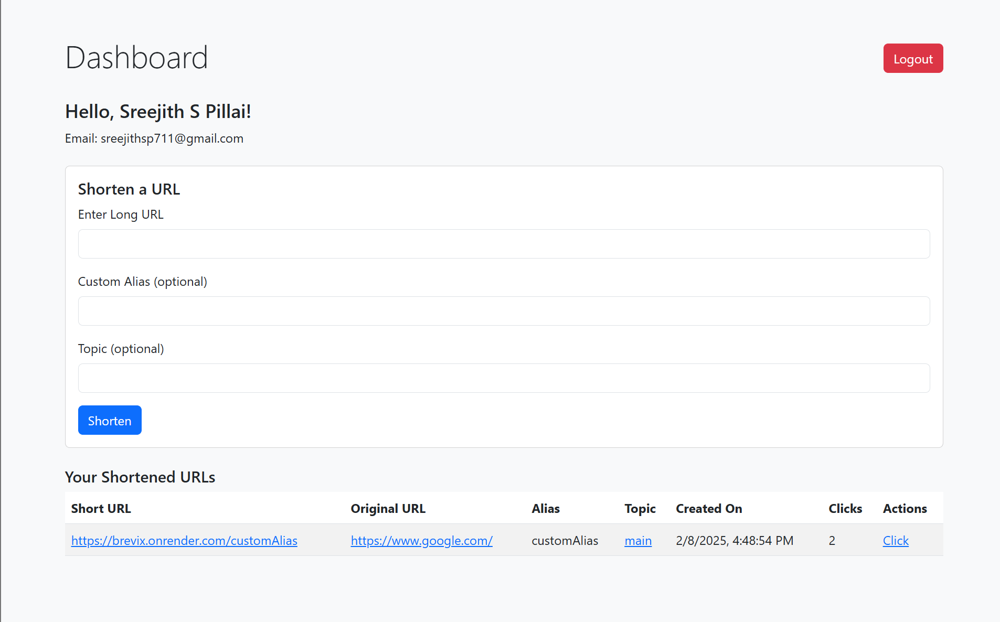

# URL Shortener (Brevix)

## Overview
This application allows users to sign in using Google, shorten long URLs, and track usage statistics. Additionally, it includes caching and rate-limiting mechanisms to optimize performance and security.




## Features
- Google Authentication (Sign in / Sign up)
- URL shortening functionality
- Usage tracking and analytics
- Caching for improved performance
- Rate limiting to prevent abuse

## Challenges Faced
- **IP Address Tracking:** Retrieving the user's device IP address was challenging, especially in production environments where results were inconsistent.
- **Production Deployment Issues:** Ensuring the correct tracking behavior across different hosting platforms required additional debugging.

## Instructions to Run the Project
1. Clone the repository:
```sh
# git clone https://github.com/sreejith97/brevix
```

2. Navigate to the project directory
```sh
# cd brevix
```
3. Install dependencies
```sh
# npm install
```
4. Start the server
```sh
# node server.js
```


# Deployment
The live version of the application is hosted and accessible at: [Deployment URL](https://brevix.onrender.com/)
